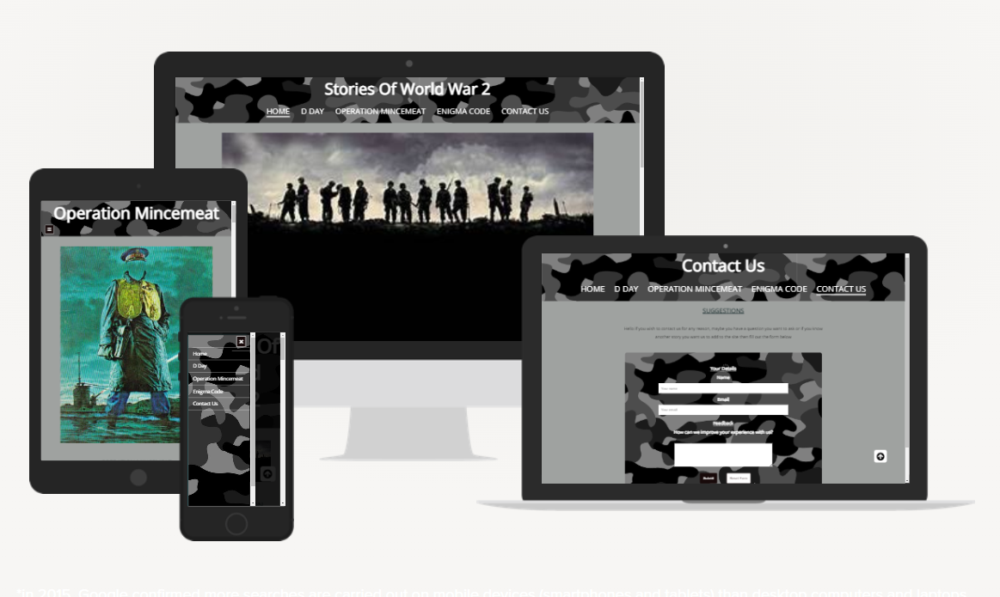

# Stories Of WW2

[view the live project here]add link

##Table of contents

1. [Introduction](#Introduction)
    1. [Wireframes](#Wireframes)
2. [Features](#Features)
    1. [Design Features](#Design-Features)
    2. [Existing Features](#Existing-Features)
    3. [Features to Implement in the future](#Features-to-Implement-in-the-future)
3. [Issues and Bugs](#Issues-and-Bugs)
5. [Technologies Used](#Technologies-Used)
    1. [Main Languages Used](#Main-Languages-Used)
    2. [Frameworks, Libraries & Programs Used](#Frameworks,-Libraries-&-Programs-Used)
6. [Testing](#Testing)
    1. [Testing.md](TESTING.md)
7. [Deployment](#Deploment)
    1. [Deploying on GitHub Pages](#Deploying-on-GitHub-Pages)
8. [Credits](#Credits)
    1. [Content](#Content)
    2. [Media](#Media)
    3. [Code](#Code)
9. [Acknowledgements](#Acknowledgements)

## Introduction

This is a website looking at some of the amazing stories of WW2 meny had a major impact in turning the tide against the Nazis and helped the allies to win the war.

The Idea came from an intrest i have had since i was small and was peaked when i joined the Armed forces and served 9 years myself. These stories had a big impact on me showing the courage and bravery people enjured to overcome one of the most brutel dictatorships in history.

This website was made for the first of five Milestone projects required to complete the Diploma in Software development (eCommerce Applications) program at The Code Institute.

The main requirements of this project are to build a responsive and static front-end site to present useful information to users using all the technologies learned so far, namely HTML5 and CSS3. The site is to contain no less than three pages.

### Wireframes 
Wireframes were made to showcase the appearance of the site pages while keeping a positive user experience in mind. The wireframes were created using a desktop version of [Balsamiq](https://balsamiq.com/).

Balsamiq Wireframes

    

   

[Back to top](#Stories-of-WW2)

## Features

### Design Features
Each page within the site has a consistent and responsive navigation system. The details of features on the site are detailed below.
- The **Header** is across the top of the page. It is not static as this would cover too much of the screen. A back-to-top button was implemented instead so users can access the navigation bar quickly.
- The **Navigation Bar** is positioned directly below the header. The navigation bar is only used for screen sizes larger than 1200px. It is then replaced by a hamburger menu.
- The **Navigation Bar** collapses into a **Hamburger Menu** that, when clicked or tapped, opens a sidebar which shows the navigation options.
- The **Footer** is 100% in width and 40px in height. It stays at the bottom of the screen at all times, on all screen sizes. Each social media link opens in a new tab. Additionally, each social media link opens a zombie related link on each respective Each page within the site has a consistent and responsive navigation system. The details of features on the site are detailed below.
- The **Header** is across the top of the page. It is not static as this would cover too much of the screen. A back-to-top button was implemented instead so users can access the navigation bar quickly.
- The **Navigation Bar** is positioned directly below the header. The navigation bar is only used for screen sizes larger than 1200px. It is then replaced by a hamburger menu.
- The **Navigation Bar** collapses into a **Hamburger Menu** that, when clicked or tapped, opens a sidebar which shows the navigation options.
- The **Footer** is 100% in width and 40px in height. It stays at the bottom of the screen at all times, on all screen sizes. Each social media link opens in a new tab.

list of pages and content layout

###Existing Features
- **Header** - Appearing on almost every page for brand recognition.
- **Navigation Bar** - Appearing on almost every page for a consistently easy and intuitive navigable system on larger screens.
- **Hamburger Menu** - Appearing on almost every page for a consistently easy and intuitive navigable system on smaller screens.
- **Social Media Icons** - Appearing on almost every page, the icons are appropriate representations of the Social Media platforms.
- **Contact Form** - A contact form is used in the Contact Page, to provide a point of contact for the user.
- **[D Day Page](d-day.html)** - Provides an overlook at operation overlord known better as d day this was massive turning point in the war as the allies opened up this second front in the west help to put pressure on the Germans.
- **[Operation Mincemeat](op-mincemeat.html)** - Provides information about this sercet operation that was used by the allies to make the Germans move troops to a differant place to allow the invasion of silicy to be a succuses.
- **[Enigma Code](enigma-code.html)** - This looks into the story of how we broke the German enigma code this allowed us to avoid German attacks and take down the U-Boat that was destroying the allies in the Alantic.
- **[Contact Us Page](contact-us.html)** - Provides a form for users to contact us and either leave feedback or point at more stories we can add to the page in the future.  

###Features to Implement in the future
- **Helpful Links Page**
     - **Feature** - Create more pages with other stories that had big impacts on the war or stories that show the real heros of this horific conflict.
     - **Reason for not featuring in this release** - Not enough time to find these out before the submission date also I may not be aware of some of these events.

[Back to top](#Stories-of-WW2)

## Issues and Bugs
The developer ran into several issues during the development of the website, with the noteworthy ones listed below, along with solutions or ideas to implement in the future.

**Navigation Bar/Hamburger Menu Responsiveness Bug** - A bug was detected while introducing responsiveness to the navigation bar and hamburger menu. At 1200px exactly, both the navigation bar and hamburger menus vanished. It was found that this was caused by setting the hamburger menu to be hidden at 1200px and up, and the navigation bar to be hidden at 1200px and down. The issue was rectified simply by changing the hamburger menu to be hidden from 1201px and up instead.

**Navigation Bar Text Color Bug** - A bug was detected when I added the hamburger menu the main text color was not showing and the main navigation bar. The fix was to add text color to the class nav-bar a so it applied once this was done the main text color appeared as its correct white color.

**Contact Us Page Footer Bug** - A bug was detected on the contact us page where the footer was not diplaying its social network icons. The fix was to add the missing font awesome link at the bottem with this missing the icons could not be displayed, once added and saved the icons appeared correctly.

**Feedback Box Lack of Responsiveness Bug** - A bug was detected with the feedback box not shrinking for smaller screens the fix was to add some css code for the text area to make the box smaller on mobile and tablet screens.

[Back to top](#Stories-of-WW2)

## Technologies Used

### Main Lanuages Used
- [HTML5](https://en.wikipedia.org/wiki/HTML5 "Link to HTML Wiki")
- [CSS3](https://en.wikipedia.org/wiki/Cascading_Style_Sheets "Link to CSS Wiki")

### Frameworks, Libraries & Programs Used
- [Google Fonts](https://fonts.google.com/ "Link to Google Fonts")
    - Google fonts was used to import the fonts into the style.css file. These fonts were used throughout the project.
- [Favicon](https://www.favicon.cc/ "Link to Favicon Generator")
     - Favicon was used to add an icon to the website tab. These were used throughout the project.
- [wikipedia](https://wikipedia.com/)
     - Wikipedia was used to get alot of the facts and pictures used thoughout the project.
- [History Page](https://history.com/)
     - The History page was used to gather facts for the stories used thoughout the projct.
- [Font Awesome](https://fontawesome.com/ "Link to FontAwesome")
     - Font Awesome was used on almost all pages throughout the website to import icons (e.g. social media icons) for UX purposes.
- [GitPod](https://gitpod.io/ "Link to GitPod homepage")
     - GitPod was used for writing code, commiting, and then pushing to GitHub.
- [GitHub](https://github.com/ "Link to GitHub")
     - GitHub was used to store the project after pushing
- [Balsamiq](https://balsamiq.com/ "Link to Balsamiq homepage")
     - Balsamiq was used to create the wireframes during the design phase of the project.

[Back to top](#Stories-of-WW2)

## Testing

Testing information can be found in a separate testing [file](TESTING.md "Link to testing file")

### Deploying on GitHub Pages
To deploy this page to GitHub Pages from its GitHub repository, the following steps were taken:

1. Log into [GitHub](https://github.com/login "Link to GitHub login page") or [create an account](https://github.com/join "Link to GitHub create account page").
2. Locate the [GitHub Repository](add link here "Link to GitHub Repo").
3. At the top of the repository, select Settings from the menu items.
4. Scroll down the Settings page to the "Pages" section.
5. Under "Source" click the drop-down menu labelled "None" and select "Main".
6. Upon selection, the page will automatically refresh meaning that the website is now deployed.
7. Scroll back down to the "Pages" section to retrieve the deployed link.

## Credits

### Content
- Some of the text used in variose pages were borrowed and adapted from various sites, Listed below.
     - [Wkipedia](https://wikipedia.com/)
     - [History](https://history.com/)
     - [IWM](https://https://www.iwm.org.uk/)
     - [Favicon](https://www.favicon.cc/)
     
### Media
- Almost all the images came from [Wikipedia](https://wikipedia.com/) but also got some from [IWM](https://https://www.iwm.org.uk/) and [Google Pictures](https://photos.google.com/)
- All videos were sourced from various channels on [YouTube](https://youtube.com/ "Link to YouTube Home Page")

### Code
The developer consulted multiple sites in order to better understand the code they were trying to implement. For code that was copied and edited, the developer made sure to reference this with the code. The following sites were used on a more regular basis:
- [Stack Overflow](https://stackoverflow.com/ "Link to Stack Overflow page")
- [W3Schools](https://www.w3schools.com/ "Link to W3Schools page")
- [MDN Docs](https://developer.mozilla.org/ "Link to MDN Web Docs")
- [DevDocs API Documentation](https://devdocs.io/ "Link to DevDocs page")

[Back to top](#Stories-of-WW2)

## Acknowledgements

- I would like to thank my family for their valued opinions and critic during the process of design and development.
- I would like to thank my tutor Seun, for their invaluable help and guidance throughout the process.
- Lastly, I would like to extend my deepest gratitude to the amazing people in Slack who helped me rigorously test every aspect of my site.

[Back to top](#Stories-of-WW2)

***
